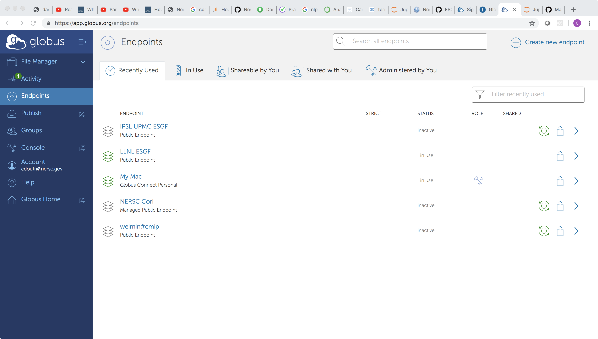
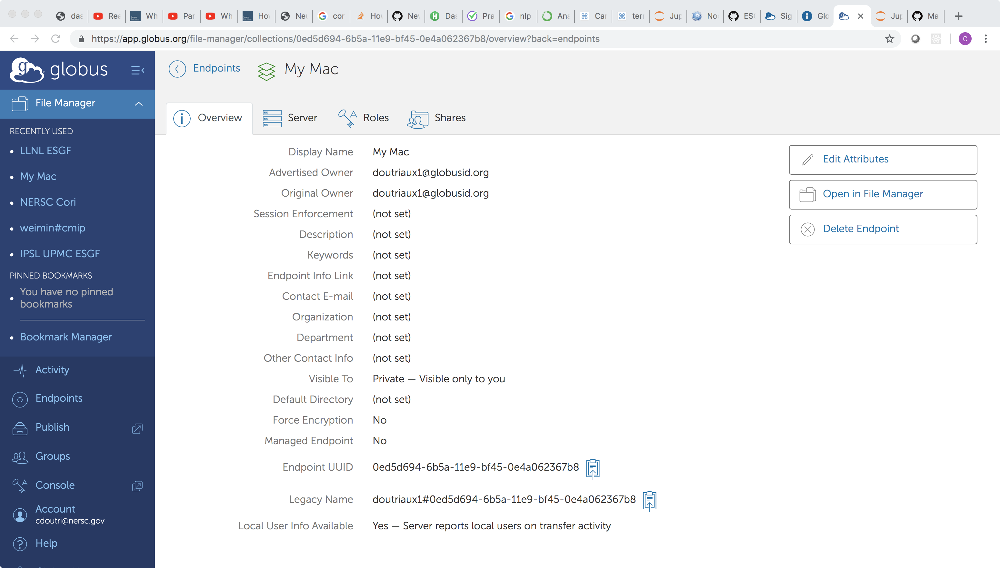
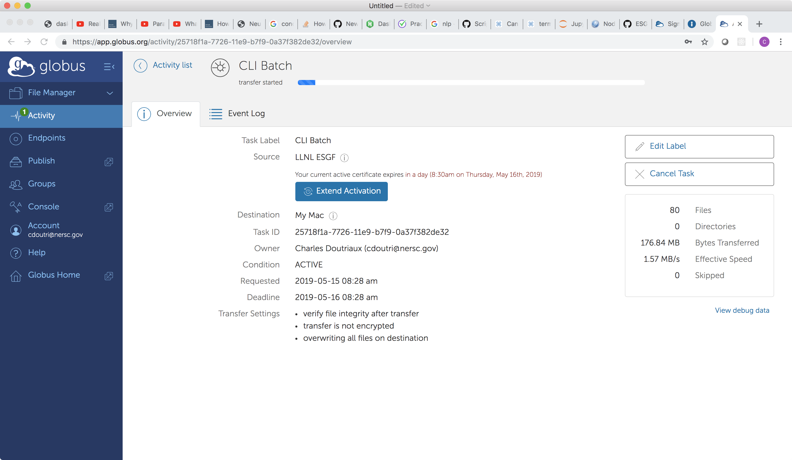

# Searching ESGF and downloading results via Globus

This notebook is intended to help users search ESGF and download result programmatically, a fully web-based version is possible at:

https://esgf.llnl.gov


## Setting Up The Environment


### Python

For this script to run you will need a Python with Globus CLI installed, for more details see:

https://docs.globus.org/cli

Provided you already have `conda` installed on your system (if not see: https://www.anaconda.com/distribution/) simply run (in bash)

```bash
conda create -n globus -c conda-forge globus-cli
source activate globus
```


### Globus

#### Selecting your end point

Go to your [globus endpoints page](https://app.globus.org/endpoints) (sign in if necessary)



Select the endpoint you which to transfer to, and lookup the endpoint uuid




In this case it would be: `0ed5d694-6b5a-11e9-bf45-0e4a062367b8`

#### Activating your end point

If you did not activate your endpoint the script will let you know and spit out a message similar to this:

```bash
The endpoint could not be auto-activated and must be activated before it can be used.

This endpoint supports the following activation methods: web, delegate proxy, myproxy
For web activation use:
'globus endpoint activate --web 415a6320-e49c-11e5-9798-22000b9da45e'
For myproxy activation use:
'globus endpoint activate --myproxy 415a6320-e49c-11e5-9798-22000b9da45e'
For delegate proxy activation use:
'globus endpoint activate --delegate-proxy X.509_PEM_FILE 415a6320-e49c-11e5-9798-22000b9da45e'
Delegate proxy activation requires an additional dependency on cryptography. See the docs for details:
https://docs.globus.org/cli/reference/endpoint_activate/
```


## Script

You can obtain this script at:

### Options

To see all options run:
```bash
python search_and_download.py --help
```

At the time this Notebook (2019/05/14) is written this leads to the following, but we encourage you to run it to make sure it is still true

```bash
python search_and_download.py --help
usage: search_and_download.py [-h] -e USER_ENDPOINT -u USERNAME [-p PATH] [-l]
                              [-s SEARCH_KEYWORDS] [-d] [-V] [-n NODE]

To use this script, you must have the Globus Command Line Interface tools
installed locally (see https://docs.globus.org/cli/) The host where you
install these tools does NOT need to be one of the endpoints in the transfer.
This script makes use of the Globus CLI 'transfer' command. You need to ensure
the endpoints involved are activated, see "Endpoints to be activated" in
output (use "globus endpoint activate") By default, the transfer command will:
- verify the checksum of the transfer - encrypt the transfer - and delete any
fies at the user endpoint with the same name.

required and optional arguments:
  -h, --help            show this help message and exit

Globus related keywords:
  -e USER_ENDPOINT, --user-endpoint USER_ENDPOINT
                        endpoint you wish to download files to (default: None)
  -u USERNAME, --username USERNAME
                        your Globus username (default: None)
  -p PATH, --path PATH  the path on your endpoint where you want files to be
                        downloaded to (default: /~/)
  -l, --list-endpoints  List the endpoints to be activated and exit (no
                        transfer attempted) (default: False)

Search related keywords:
  -s SEARCH_KEYWORDS, --search-keywords SEARCH_KEYWORDS
                        dictionary with search keys (default: {'variable':
                        ['tas', 'clt'], 'experiment_id': 'historical',
                        'frequency': 'mon', 'institution_id': 'NASA-GISS'})
  -d, --distributed     search all nodes, not just local (default: False)
  -V, --verbose
  -n NODE, --node NODE  search node (default: https://esgf-node.llnl.gov/esg-
                        search/search)
```


### Examples

This section shows some use case examples


#### Default example

By default the search will look for:

* variable: `tas`
* experiemnt_id: `historical`
* frequency: `mon`
* insitution_id: `NASA-GISS`

runnning:

```bash
python search_and_download.py -e [END_POINT] -u [USER]@globusid.org
```

Leads to

```
Search resulted in: 40 files

First 5 files:
globus:415a6320-e49c-11e5-9798-22000b9da45e/css03_data/CMIP6/CMIP/NASA-GISS/GISS-E2-1-G/historical/r10i1p1f1/Amon/tas/gn/v20180830/tas_Amon_GISS-E2-1-G_historical_r10i1p1f1_gn_185001-190012.nc
globus:415a6320-e49c-11e5-9798-22000b9da45e/css03_data/CMIP6/CMIP/NASA-GISS/GISS-E2-1-G/historical/r10i1p1f1/Amon/tas/gn/v20180830/tas_Amon_GISS-E2-1-G_historical_r10i1p1f1_gn_190101-195012.nc
globus:415a6320-e49c-11e5-9798-22000b9da45e/css03_data/CMIP6/CMIP/NASA-GISS/GISS-E2-1-G/historical/r10i1p1f1/Amon/tas/gn/v20180830/tas_Amon_GISS-E2-1-G_historical_r10i1p1f1_gn_195101-200012.nc
globus:415a6320-e49c-11e5-9798-22000b9da45e/css03_data/CMIP6/CMIP/NASA-GISS/GISS-E2-1-G/historical/r10i1p1f1/Amon/tas/gn/v20180830/tas_Amon_GISS-E2-1-G_historical_r10i1p1f1_gn_200101-201412.nc
globus:415a6320-e49c-11e5-9798-22000b9da45e/css03_data/CMIP6/CMIP/NASA-GISS/GISS-E2-1-G/historical/r1i1p1f1/Amon/tas/gn/v20180827/tas_Amon_GISS-E2-1-G_historical_r1i1p1f1_gn_185001-190012.nc
[...]
Last 5 files:
globus:415a6320-e49c-11e5-9798-22000b9da45e/css03_data/CMIP6/CMIP/NASA-GISS/GISS-E2-1-G/historical/r8i1p1f1/Amon/tas/gn/v20180830/tas_Amon_GISS-E2-1-G_historical_r8i1p1f1_gn_200101-201412.nc
globus:415a6320-e49c-11e5-9798-22000b9da45e/css03_data/CMIP6/CMIP/NASA-GISS/GISS-E2-1-G/historical/r9i1p1f1/Amon/tas/gn/v20180830/tas_Amon_GISS-E2-1-G_historical_r9i1p1f1_gn_185001-190012.nc
globus:415a6320-e49c-11e5-9798-22000b9da45e/css03_data/CMIP6/CMIP/NASA-GISS/GISS-E2-1-G/historical/r9i1p1f1/Amon/tas/gn/v20180830/tas_Amon_GISS-E2-1-G_historical_r9i1p1f1_gn_190101-195012.nc
globus:415a6320-e49c-11e5-9798-22000b9da45e/css03_data/CMIP6/CMIP/NASA-GISS/GISS-E2-1-G/historical/r9i1p1f1/Amon/tas/gn/v20180830/tas_Amon_GISS-E2-1-G_historical_r9i1p1f1_gn_195101-200012.nc
globus:415a6320-e49c-11e5-9798-22000b9da45e/css03_data/CMIP6/CMIP/NASA-GISS/GISS-E2-1-G/historical/r9i1p1f1/Amon/tas/gn/v20180830/tas_Amon_GISS-E2-1-G_historical_r9i1p1f1_gn_200101-201412.nc
Do you wish to continue [y]/n?
```

After answering yes, the script will setup the transfer and you will get a message similar to:

```bash
Message: The transfer has been accepted and a task has been created and queued for execution
Task ID: fa0f45b4-772b-11e9-8e59-029d279f7e24
```

Going to: https://app.globus.org/activity/

You can check on the satus




Once the task is completed you receive an email from `Globus Notification <no-reply@globus.org>` with subject
```
SUCCEEDED - CLI Batch
```

and a body similar to the following

```
TASK DETAILS
Task ID: fa0f45b4-772b-11e9-8e59-029d279f7e24
Task Type: TRANSFER
Status: SUCCEEDED
Source: LLNL ESGF (415a6320-e49c-11e5-9798-22000b9da45e)
Destination: My Mac (0ed5d694-6b5a-11e9-bf45-0e4a062367b8)
Label: CLI Batch

https://app.globus.org/activity/fa0f45b4-772b-11e9-8e59-029d279f7e24/overview
```


#### Passing keys to the search

The search keys must be passed via a dictionary

The search keys can be passed from the command line via the `-s` (or `--search_keys`) argument, for example the default search can be rewritten as:
```bash
python search_and_download.py -e 0ed5d694-6b5a-11e9-bf45-0e4a062367b8 -u doutriaux1@globusid.org -s "{'variable':'tas', 'experiment_id': 'historical', 'frequency':'mon', 'institution_id': 'NASA-GISS'}"
```

Searching for `clt` rather than `tas` for an `amip` experiment would be done via:

```bash
python search_and_download.py -e 0ed5d694-6b5a-11e9-bf45-0e4a062367b8 -u doutriaux1@globusid.org --search_keywords "{'variable':'clt', 'experiment_id': 'amip', 'frequency':'mon', 'institution_id': 'NASA-GISS'}"
```

Which leads to:

```bash
Search resulted in: 20 files

First 5 files:
globus:415a6320-e49c-11e5-9798-22000b9da45e/css03_data/CMIP6/CMIP/NASA-GISS/GISS-E2-1-G/amip/r1i1p1f1/Amon/clt/gn/v20181016/clt_Amon_GISS-E2-1-G_amip_r1i1p1f1_gn_185001-190012.nc
globus:415a6320-e49c-11e5-9798-22000b9da45e/css03_data/CMIP6/CMIP/NASA-GISS/GISS-E2-1-G/amip/r1i1p1f1/Amon/clt/gn/v20181016/clt_Amon_GISS-E2-1-G_amip_r1i1p1f1_gn_190101-195012.nc
globus:415a6320-e49c-11e5-9798-22000b9da45e/css03_data/CMIP6/CMIP/NASA-GISS/GISS-E2-1-G/amip/r1i1p1f1/Amon/clt/gn/v20181016/clt_Amon_GISS-E2-1-G_amip_r1i1p1f1_gn_195101-200012.nc
globus:415a6320-e49c-11e5-9798-22000b9da45e/css03_data/CMIP6/CMIP/NASA-GISS/GISS-E2-1-G/amip/r1i1p1f1/Amon/clt/gn/v20181016/clt_Amon_GISS-E2-1-G_amip_r1i1p1f1_gn_200101-201412.nc
globus:415a6320-e49c-11e5-9798-22000b9da45e/css03_data/CMIP6/CMIP/NASA-GISS/GISS-E2-1-G/amip/r2i1p1f1/Amon/clt/gn/v20181016/clt_Amon_GISS-E2-1-G_amip_r2i1p1f1_gn_185001-190012.nc
[...]
Last 5 files:
globus:415a6320-e49c-11e5-9798-22000b9da45e/css03_data/CMIP6/CMIP/NASA-GISS/GISS-E2-1-G/amip/r4i1p1f1/Amon/clt/gn/v20181016/clt_Amon_GISS-E2-1-G_amip_r4i1p1f1_gn_200101-201412.nc
globus:415a6320-e49c-11e5-9798-22000b9da45e/css03_data/CMIP6/CMIP/NASA-GISS/GISS-E2-1-G/amip/r5i1p1f1/Amon/clt/gn/v20181016/clt_Amon_GISS-E2-1-G_amip_r5i1p1f1_gn_185001-190012.nc
globus:415a6320-e49c-11e5-9798-22000b9da45e/css03_data/CMIP6/CMIP/NASA-GISS/GISS-E2-1-G/amip/r5i1p1f1/Amon/clt/gn/v20181016/clt_Amon_GISS-E2-1-G_amip_r5i1p1f1_gn_190101-195012.nc
globus:415a6320-e49c-11e5-9798-22000b9da45e/css03_data/CMIP6/CMIP/NASA-GISS/GISS-E2-1-G/amip/r5i1p1f1/Amon/clt/gn/v20181016/clt_Amon_GISS-E2-1-G_amip_r5i1p1f1_gn_195101-200012.nc
globus:415a6320-e49c-11e5-9798-22000b9da45e/css03_data/CMIP6/CMIP/NASA-GISS/GISS-E2-1-G/amip/r5i1p1f1/Amon/clt/gn/v20181016/clt_Amon_GISS-E2-1-G_amip_r5i1p1f1_gn_200101-201412.nc
Do you wish to continue [y]/n?
```

One might want to search for multiple values for a field, this is obtain by passinbg the values as a list

Searching for both `ta` and `cl` in the above search would be done via:

```bash
python search_and_download.py -e 0ed5d694-6b5a-11e9-bf45-0e4a062367b8 -u doutriaux1@globusid.org --search-keywords "{'variable':['ta', 'cl'], 'experiment_id': 'amip', 'frequency':'mon', 'institution_id': 'NASA-GISS'}"
```

Which leads to:

```bash
Search resulted in: 40 files

First 5 files:
globus:415a6320-e49c-11e5-9798-22000b9da45e/css03_data/CMIP6/CMIP/NASA-GISS/GISS-E2-1-G/amip/r1i1p1f1/Amon/cl/gn/v20181016/cl_Amon_GISS-E2-1-G_amip_r1i1p1f1_gn_185001-190012.nc
globus:415a6320-e49c-11e5-9798-22000b9da45e/css03_data/CMIP6/CMIP/NASA-GISS/GISS-E2-1-G/amip/r1i1p1f1/Amon/cl/gn/v20181016/cl_Amon_GISS-E2-1-G_amip_r1i1p1f1_gn_190101-195012.nc
globus:415a6320-e49c-11e5-9798-22000b9da45e/css03_data/CMIP6/CMIP/NASA-GISS/GISS-E2-1-G/amip/r1i1p1f1/Amon/cl/gn/v20181016/cl_Amon_GISS-E2-1-G_amip_r1i1p1f1_gn_195101-200012.nc
globus:415a6320-e49c-11e5-9798-22000b9da45e/css03_data/CMIP6/CMIP/NASA-GISS/GISS-E2-1-G/amip/r1i1p1f1/Amon/cl/gn/v20181016/cl_Amon_GISS-E2-1-G_amip_r1i1p1f1_gn_200101-201412.nc
globus:415a6320-e49c-11e5-9798-22000b9da45e/css03_data/CMIP6/CMIP/NASA-GISS/GISS-E2-1-G/amip/r1i1p1f1/Amon/ta/gn/v20181016/ta_Amon_GISS-E2-1-G_amip_r1i1p1f1_gn_185001-190012.nc
[...]
Last 5 files:
globus:415a6320-e49c-11e5-9798-22000b9da45e/css03_data/CMIP6/CMIP/NASA-GISS/GISS-E2-1-G/amip/r5i1p1f1/Amon/cl/gn/v20181016/cl_Amon_GISS-E2-1-G_amip_r5i1p1f1_gn_200101-201412.nc
globus:415a6320-e49c-11e5-9798-22000b9da45e/css03_data/CMIP6/CMIP/NASA-GISS/GISS-E2-1-G/amip/r5i1p1f1/Amon/ta/gn/v20181016/ta_Amon_GISS-E2-1-G_amip_r5i1p1f1_gn_185001-190012.nc
globus:415a6320-e49c-11e5-9798-22000b9da45e/css03_data/CMIP6/CMIP/NASA-GISS/GISS-E2-1-G/amip/r5i1p1f1/Amon/ta/gn/v20181016/ta_Amon_GISS-E2-1-G_amip_r5i1p1f1_gn_190101-195012.nc
globus:415a6320-e49c-11e5-9798-22000b9da45e/css03_data/CMIP6/CMIP/NASA-GISS/GISS-E2-1-G/amip/r5i1p1f1/Amon/ta/gn/v20181016/ta_Amon_GISS-E2-1-G_amip_r5i1p1f1_gn_195101-200012.nc
globus:415a6320-e49c-11e5-9798-22000b9da45e/css03_data/CMIP6/CMIP/NASA-GISS/GISS-E2-1-G/amip/r5i1p1f1/Amon/ta/gn/v20181016/ta_Amon_GISS-E2-1-G_amip_r5i1p1f1_gn_200101-201412.nc
Do you wish to continue [y]/n?
```

Finally you can controll where the files go on your endpoint via the `-p` option

```bash
python search_and_download.py -e 0ed5d694-6b5a-11e9-bf45-0e4a062367b8 -u doutriaux1@globusid.org --search-keywords "{'variable':'clt', 'experiment_id': 'amip', 'frequency':'mon', 'institution_id': 'NASA-GISS'}"   -p /~/CWT/ESGF/
```

